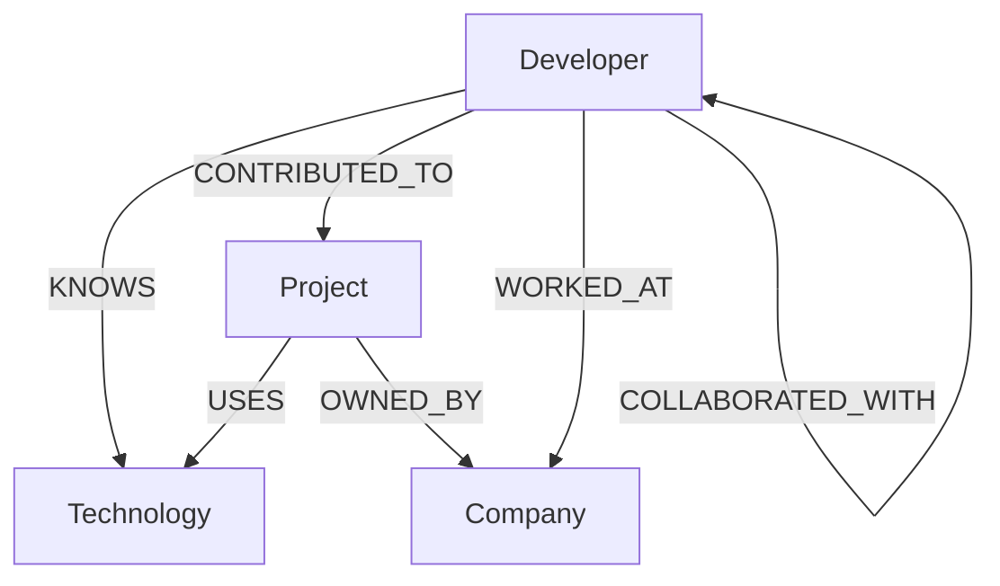
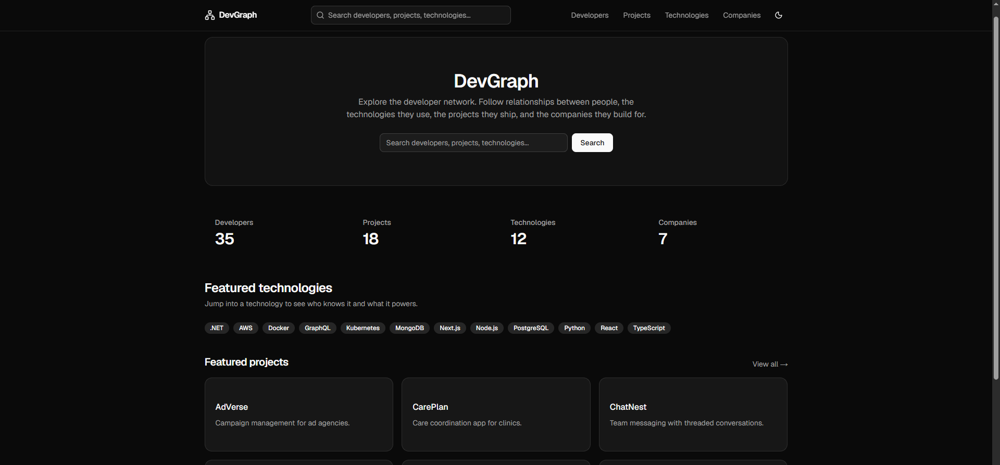
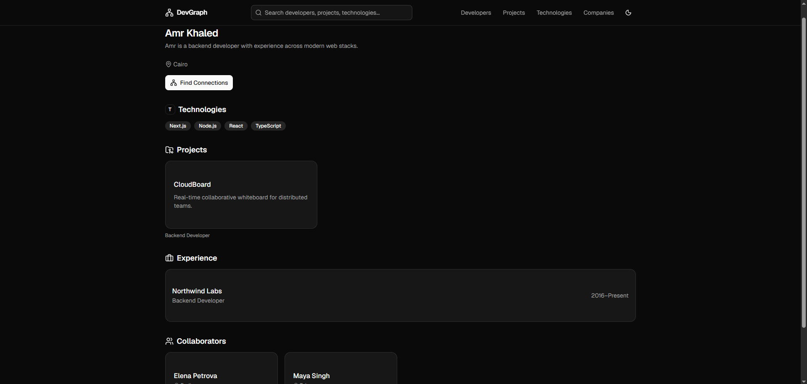
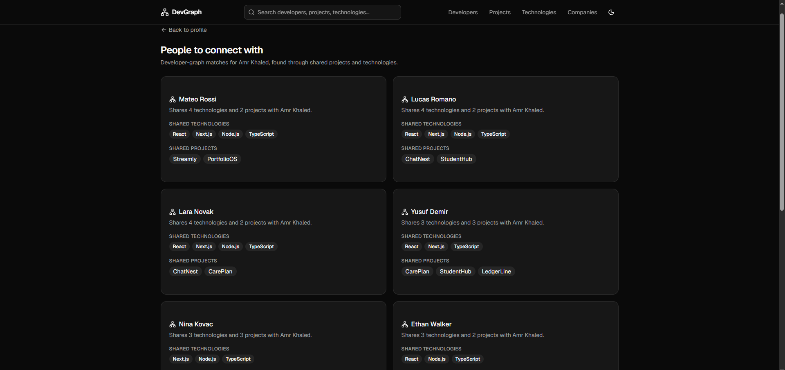
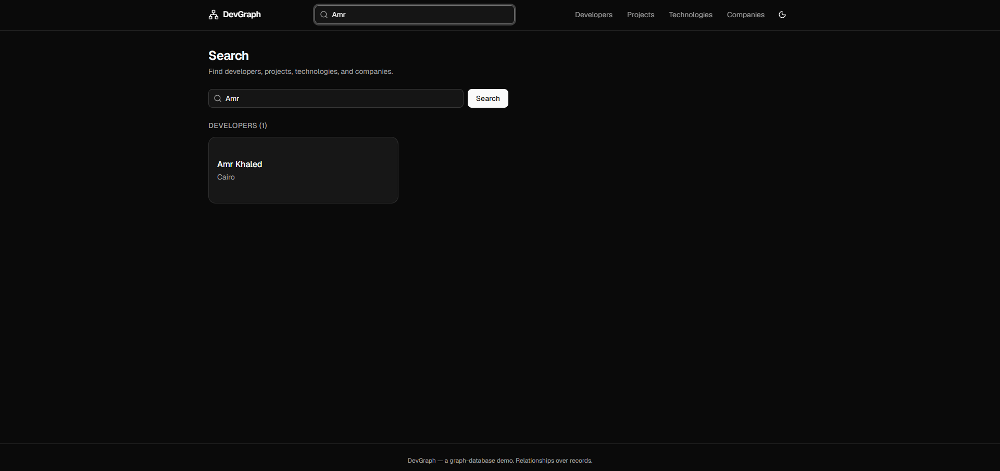

# DevGraph

A developer-network explorer backed by **CognoDB** (a managed graph database that
speaks Bolt + Cypher) via the official **Neo4j JavaScript driver**. DevGraph makes
relationship traversal the core of the product: you explore how developers,
technologies, projects, and companies connect through multi-hop graph queries.

> This is a take-home assignment demo. All data is fictional.

---

## Overview

DevGraph answers questions that are naturally about *relationships*, not records:

- Who should this developer connect with, based on shared projects and technologies?
- What technologies does a developer use indirectly through the projects they ship?
- Which developers work at a company and on which projects?
- How does a technology propagate across the network?

The "Find Connections" feature (the showcase) is a 2-hop traversal that would be
awkward to express in a relational database.

## Features

- Dashboard with live graph counts, featured technologies, and featured projects.
- Browse developers, projects, technologies, and companies.
- Detail pages that surface the surrounding graph (technologies, projects, companies, collaborators).
- **Find Connections** — potential collaborators via shared projects + technologies.
- Global search across all four entity types.
- Loading, empty, and error states everywhere; graceful handling when the database is unreachable.

## Why a Graph Database?

The interesting questions in DevGraph are about *paths and adjacency*, not about
fetching a single row. Consider the showcase query: given a developer, find other
developers who contribute to a project that uses a technology the focal developer
also touches through their own projects. That is a multi-hop traversal:

```
Developer → CONTRIBUTED_TO → Project → USES → Technology
         ← USES ← Project ← CONTRIBUTED_TO ← Developer
```

In a relational schema this becomes a nest of self-joins across
`developers`, `projects`, `project_technologies`, and `technologies` — and the
"shared projects" vs "shared technologies" aggregation is fiddly and slow to
evolve. In a graph database the traversal is a single declarative pattern, and
adding relationship types later (e.g. `MENTORED`, `FOLLOWS`) does not require
schema migrations.

Graph databases are **not** universally faster than relational databases. They win
when the access pattern is relationship-centric and multi-hop. DevGraph's value
lives there, which is why a graph model fits.

## Architecture

```
React UI (client components)
   │  fetch()
   ▼
Next.js API layer  (src/app/api/**/route.ts)
   │  parameterized Cypher via query layer
   ▼
Query/service layer (src/lib/queries/*)
   │  neo4j-driver
   ▼
CognoDB (Bolt + openCypher)
```

- Pages are **client components** that call the API; they never import the
  database or query layer directly, so `next build` never touches CognoDB.
- All Cypher is **parameterized** — user input is never concatenated into queries.
- A single shared Neo4j driver is reused; sessions are always closed in `finally`.
- Neo4j `Integer` values are converted to native numbers before reaching the UI.

## Data Model

Four node types:

```
(:Developer { id, name, bio, location })
(:Technology { id, name, category })
(:Project { id, name, description })
(:Company { id, name, industry })
```

Relationships:

| Relationship | Direction | Properties |
|--------------|-----------|------------|
| `KNOWS` | Developer → Technology | — |
| `CONTRIBUTED_TO` | Developer → Project | `role` |
| `WORKED_AT` | Developer → Company | `role`, `startYear`, `endYear` |
| `USES` | Project → Technology | — |
| `OWNED_BY` | Project → Company | — |
| `COLLABORATED_WITH` | Developer ↔ Developer | — |

## Graph Diagram



## Main Cypher Queries

All queries live in `src/lib/queries/` and are parameterized.

### Query 1 — Technologies a developer knows

```cypher
MATCH (d:Developer {id: $developerId})-[:KNOWS]->(t:Technology)
RETURN t ORDER BY t.name
```

### Query 2 — Technologies used by a developer's projects (multi-hop)

```cypher
MATCH (d:Developer {id: $developerId})-[:CONTRIBUTED_TO]->(p:Project)-[:USES]->(t:Technology)
RETURN DISTINCT t ORDER BY t.name
```

### Query 3 — Potential collaborators (showcase, 2-hop, relational-awkward)

```cypher
MATCH (me:Developer {id: $developerId})-[:CONTRIBUTED_TO]->(myProject:Project)
      -[:USES]->(technology:Technology)
      <-[:USES]-(otherProject:Project)<-[:CONTRIBUTED_TO]-(other:Developer)
WHERE other.id <> me.id
RETURN other,
       collect(DISTINCT technology.name) AS sharedTechnologies,
       collect(DISTINCT otherProject.name) AS sharedProjects
ORDER BY size(sharedTechnologies) DESC, size(sharedProjects) DESC
LIMIT 10
```

This powers **Find Connections**. Expressing the shared-technology / shared-project
aggregation and ranking in SQL requires multiple self-joins and set operations.

### Query 4 — Collaboration network (variable-depth traversal)

```cypher
MATCH (me:Developer {id: $developerId})-[:COLLABORATED_WITH*1..3]-(other:Developer)
WHERE other.id <> me.id
RETURN DISTINCT other ORDER BY other.name LIMIT 20
```

## Tech Stack

- Next.js 16 (App Router, `src/`)
- React 19 + TypeScript
- Tailwind CSS v4 + shadcn/ui
- Neo4j JavaScript driver (`neo4j-driver`) → CognoDB (Bolt + Cypher)
- ESLint

## Local Setup

```bash
npm install
cp .env.example .env.local   # then fill in your CognoDB credentials
npm run seed                 # load fictional data into CognoDB
npm run dev                  # http://localhost:3000
```

## Environment Variables

`.env.example`:

```env
COGNODB_URI=
COGNODB_USERNAME=cognodb
COGNODB_PASSWORD=
```

## Seed Data

`scripts/seed.ts` is deterministic and idempotent (uses `MERGE` on stable ids).
Running it multiple times is safe.

- 35 Developers, 12 Technologies, 18 Projects, 7 Companies
- Relationships: `KNOWS`, `CONTRIBUTED_TO` (role), `WORKED_AT` (role, years),
  `USES`, `OWNED_BY`, `COLLABORATED_WITH` (derived from shared projects)

Run it with:

```bash
npm run seed
```

## Running the Application

```bash
npm run dev      # development
npm run build    # production build
npm run start    # serve the production build
npm run lint     # eslint
```

## API Reference

| Method | Route | Description |
|--------|-------|-------------|
| GET | `/api/stats` | Graph counts |
| GET | `/api/developers` | List developers |
| GET | `/api/developers/[id]` | Developer with relations |
| GET | `/api/developers/[id]/connections` | Potential collaborators (Query 3) |
| GET | `/api/projects` | List projects |
| GET | `/api/projects/[id]` | Project with relations |
| GET | `/api/technologies` | List technologies |
| GET | `/api/technologies/[id]` | Technology with relations |
| GET | `/api/companies` | List companies |
| GET | `/api/companies/[id]` | Company with relations |
| GET | `/api/search?q=` | Global search |

Database failures return a safe `503` with no credentials or stack traces.

## Demo

The app is a standard Next.js project and deploys to Vercel with no custom
configuration (a `vercel.json` is included for clarity).

## Screenshots
Homepage


Developer Details


Find Connections


Search


## Project Structure

```
src/
  app/
    api/            # Next.js route handlers (API layer)
    developers/     # list, [id] detail, [id]/connections
    projects/       # list, [id] detail
    technologies/   # list, [id] detail
    companies/      # list, [id] detail
    search/         # global search
    layout.tsx page.tsx globals.css
  components/
    ui/             # shadcn primitives
    layout/         # SiteHeader
    common/         # cards, badges, states, skeletons, useAsync
  lib/
    db.ts           # neo4j-driver singleton + runRead + error normalization
    api.ts          # route response helpers
    client.ts       # client-side fetch helper
    queries/        # parameterized Cypher (developers, projects, ...)
  types/
    graph.ts        # node/relation/result types
scripts/
  seed.ts           # deterministic, idempotent seed
```
